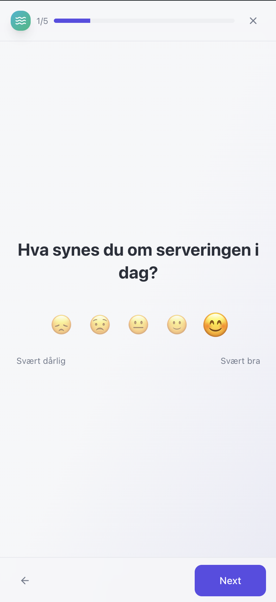
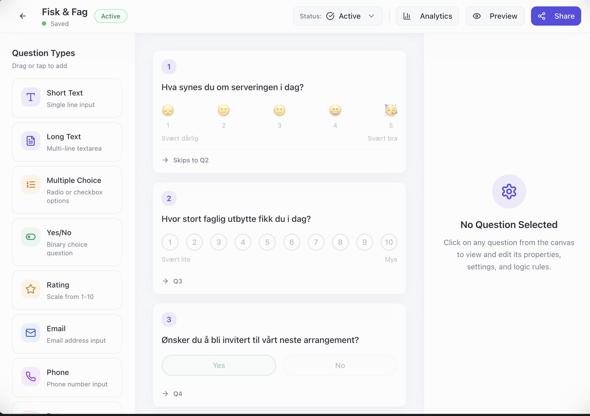

# VibeForm.fun

Welcome to **[VibeForm.fun](https://vibeform.fun)**! 🚀

This repo is part of a talk I gave at the **Minus 1** event in Oslo on November 20, 2025. The presentation, titled **"Klarer vi å utfordre en enhjørning på én kveld?"** (Can we challenge a unicorn in one evening?), focused on the power of high-level AI coding platforms. You can **[view the presentation slides here](https://www.figma.com/deck/5y2FRmTLphEc9BP0sv7vxf/Presentasjon_Nov20?node-id=3-296&t=5Ae5wQzWz9CSFU5c-1)**.

During the talk, we "live" (well, pre-recorded live) vibe coded this simple, open-source Typeform alternative using **Lovable** and **Supabase**. The goal was to show how fast you can build an almost production-ready app with the right tools and a bit of AI magic.

<div align="center">
  
  &nbsp;&nbsp;&nbsp;&nbsp;
  
</div>

## Features

Here is what we built:

1.  **Login/Signup**: Secure authentication powered by Supabase.
2.  **Dashboard & Form Builder**: A drag-and-drop interface to create forms. Started simple, then we iterated to make it robust and user-friendly.
3.  **Rich Question Types**: Extended the builder with multiple question types (Rating, Text, Multiple Choice, etc.).
4.  **Logic Rules**: Implemented advanced branching and question flow, allowing for dynamic forms that adapt to user input.
5.  **Public Response Page**: A sleek, public-facing page for users to answer forms.
6.  **Real-time Analytics**: A dashboard to view responses and question performance in real-time.

> **Note**: Since the talk, I've continued to polish the app (e.g., making it mobile-friendly), but the prompt history below reflects the journey during the "challenge".

## Prompt History

Curious how we built this? I've documented the most important prompts used to generate the app in Lovable. It's structured by feature, starting with the UI mockups and moving through the major functionality. Note that this isn't an exhaustive log of every single interaction, but covers the key prompts that drove the development.

> **Pro Tip**: Most of these prompts were executed in **Chat Mode** (rather than just the builder) to force the AI to generate a detailed implementation plan before writing code.

Check out the **[Prompts Directory](./prompts/)** or jump to a specific section:

-   **[UI Mockups (UXPilot)](./prompts/ux-pilot.md)**
-   **[1. Login & Signup (Initial Project Prompt)](./prompts/01-login-signup.md)**
-   **[2. Dashboard & Form Builder](./prompts/02-dashboard-builder.md)**
-   **[3. Extending Question Types](./prompts/03-question-types.md)**
-   **[4. Logic Rules](./prompts/04-logic-rules.md)**
-   **[5. Public Page & Edge Functions](./prompts/05-public-page.md)**
-   **[6. Real-time Analytics](./prompts/06-analytics.md)**

Each section contains the **Initial Prompt** that kicked off the feature, followed by the smaller **Fixes** and refinements we made along the way.

## Setup & Run

Want to run this yourself? Here's how to get started.

### Prerequisites

-   Node.js & npm
-   Supabase CLI (for local development)

### Installation

1.  **Clone the repo**:
    ```bash
    git clone <YOUR_GIT_URL>
    cd VibeForm.fun
    ```

2.  **Install dependencies**:
    ```bash
    npm install
    ```

3.  **Configure Environment Variables**:
    The `.env` file is included in the repo for your convenience.
    
    > **Note on Security**: You might notice the `.env` file is committed. This is intentional for this demo. The keys inside (`VITE_SUPABASE_URL` and `VITE_SUPABASE_ANON_KEY`) are **public client-side keys**.
    >
    > **Important**: To run this project with your own backend, you **must update these values** in the `.env` file to match your own Supabase project credentials.

4.  **Start the development server**:
    ```bash
    npm run dev
    ```

### Supabase Backend

This project uses Supabase for the database and auth. To run it locally or deploy it to your own project:

1.  **Local Development**:
    ```bash
    supabase start
    ```
    This will spin up a local Supabase instance.

2.  **Migrations**:
    The database schema is managed via migrations. You can find them in the `supabase/migrations` folder. Apply them with:
    ```bash
    supabase migration up
    ```

3.  **Edge Functions**:
    We use Supabase Edge Functions for some backend logic (like handling form submissions securely).
    ```bash
    supabase functions serve
    ```

---

*Built with ❤️ (and a lot of AI) for Minus 1.*
