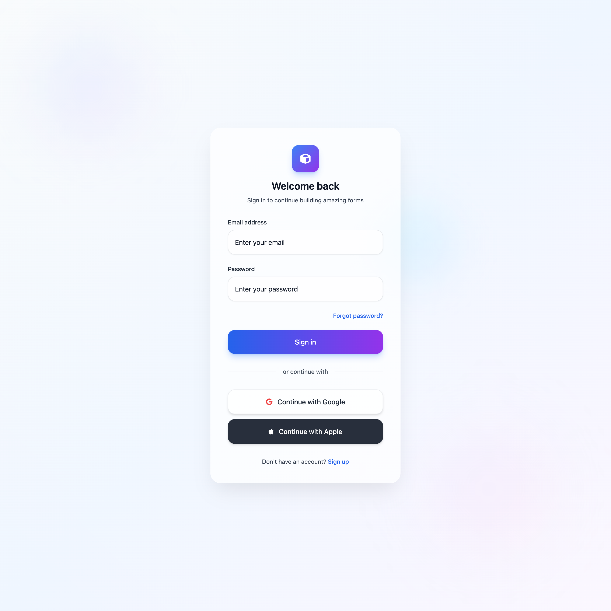
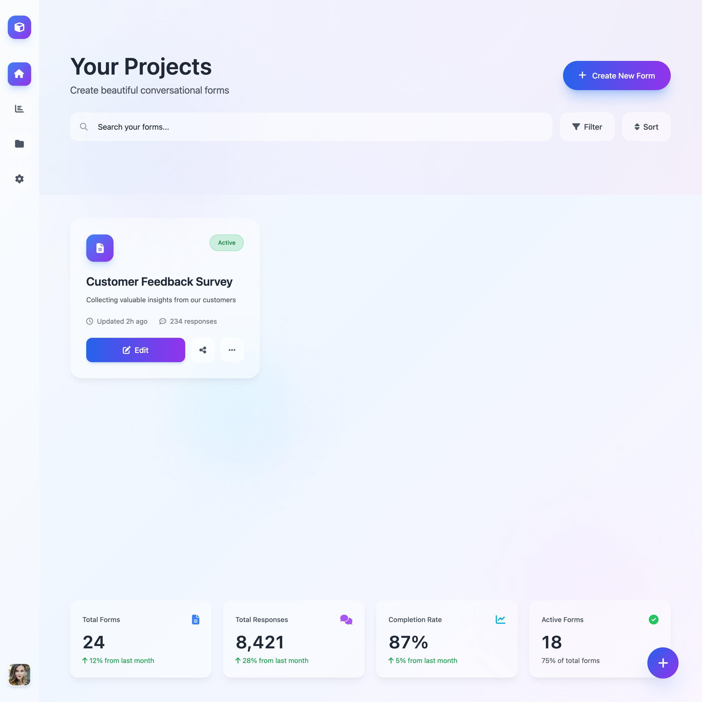
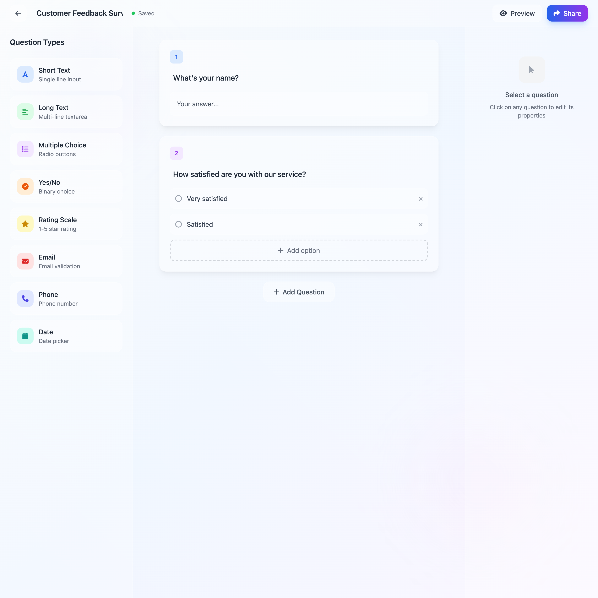
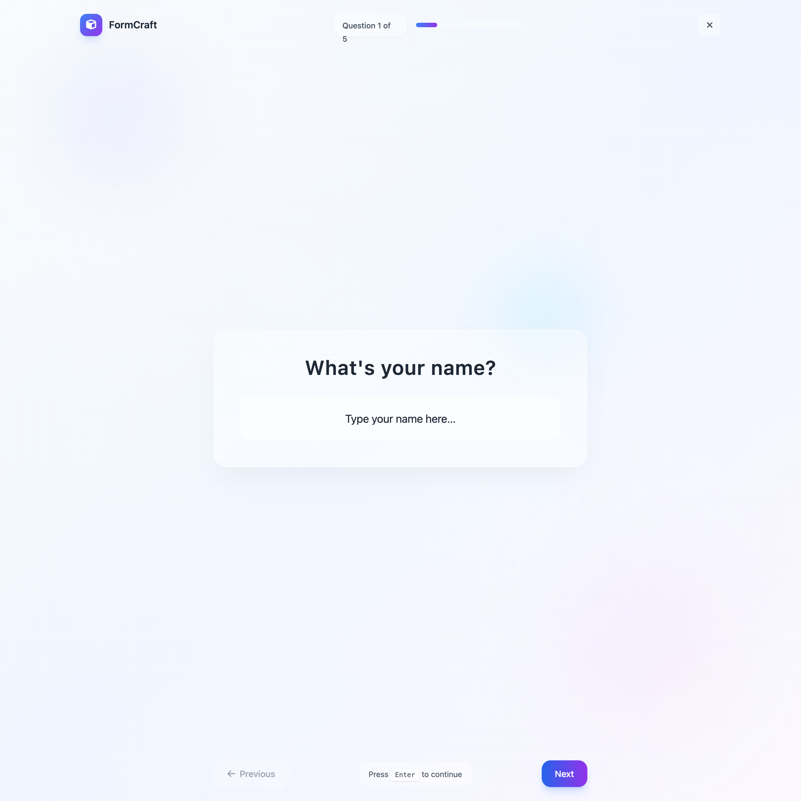
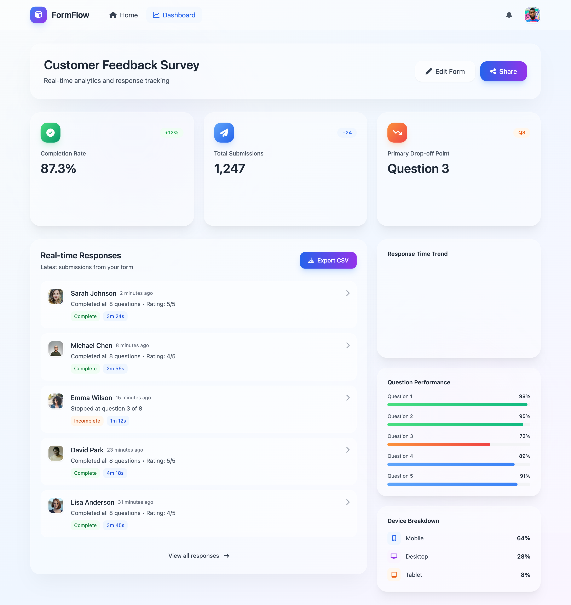

# UX Pilot Prompts

These are the prompts used to generate the initial UI mockups in UXPilot.

## Initial Context & Flow Prompt
> **CONTEXT:**
> You are designing a modern web-based SaaS application for building and responding to conversational forms (similar to Typeform). The product should feel premium, minimalistic, and emotionally pleasant, using a modern Apple-inspired liquid-glass design language across all screens.
>
> **Design Language (Very Important):**
> *   **Liquid Glass Aesthetic**: Translucent frosted panels, soft blurs, light refractions, subtle depth.
> *   **Neutral Light Palette**: White, off-white, soft gray, pastel accents.
> *   **Minimalistic UI**: Plenty of spacing, clean typography, low-noise surfaces.
> *   **Rounded Geometry**: Smooth radiuses, Apple-like curvature.
> *   **Soft Shadows**: Very subtle elevation, calm gradients.
> *   **Motion**: Gentle, elegant micro-animations; no hard transitions.
> *   **Typography**: Modern geometric sans-serif (SF Pro–inspired).
> *   **Iconography**: Thin-line icons with minimal detail.
> *   **Consistency**: All elements follow the same material feel, layering, and translucency.
>
> **FLOW:**
> **Overall Intent:**
> Design the complete end-to-end flow of a modern SaaS tool for creating and answering conversational forms. All screens use a unified Apple-inspired liquid-glass aesthetic: frosted translucency, soft shadows, rounded geometry, calm gradients, generous spacing, premium typography, and smooth micro-animations.
>
> This flow should describe how the user moves through the product, not the UI of each page (that is defined in the individual screen prompts below).
>
> **🔄 High-Level Flow**
>
> **1. Authentication → Home**
> Users start by logging in or signing up. Once authenticated, they land on Home, where all their forms/projects are listed. From here they can:
> *   Open an existing form
> *   Create a new form
> *   Navigate to profile/settings
>
> **2. Home → Form Builder**
> Selecting or creating a form opens the Form Builder, which is the core work area. Here the user can:
> *   Add questions
> *   Edit questions
> *   Reorder questions
> *   Configure logic
> *   Preview the respondent experience
> *   Access share settings
> *   Return to Home
> All builder interactions should feel fluid, calm, and premium.
>
> **3. Builder → Logic Editor**
> From the builder, the user can open a Logic Editor (panel or modal). They define simple rules like: “If answer to Question X = Y → Jump to Question Z.” Closing the logic view returns the user back to the builder.
>
> **4. Builder → Preview (Respondent Simulation)**
> The user can switch into Preview Mode to experience the form exactly as a respondent sees it. Preview is full screen, one question at a time. Exiting preview returns directly to the builder at the same scroll position.
>
> **5. Builder → Share Settings**
> From the builder’s main toolbar, “Share” opens the Share Settings screen, where the user can:
> *   Copy the public link
> *   View a QR code
> *   Optional: Send link via SMS
> *   Set visibility (public/private)
> After sharing, they typically return to the builder or navigate back to Home.
>
> **6. Respondent Flow (Public Link)**
> Respondents open the public link and see the conversational, one-question-at-a-time player. They move through questions smoothly, submit at the end, and see a confirmation screen. This flow is separate from the creator experience.
>
> **7. Home → Dashboard (Responses)**
> From the Home screen, clicking on any form also allows navigating to the Dashboard, showing:
> *   Submission list (real-time)
> *   Basic analytics
> *   Export CSV
> *   Open single-response detail view
> The user can always go back to Home or jump into the Builder from here.
>
> **8. Dashboard → Response Detail**
> Selecting a single response opens a detail view showing all answers from one submission. Navigation allows moving between responses or returning to the dashboard list.
>
> **9. Settings / Profile**
> Accessible from global navigation. Users can update account details and sign out. Returning from Settings goes back to the Home screen.

## Screen Prompts

### Authentication (Login/Signup)
> Design a login/signup screen for a SaaS form-building application using the global liquid-glass Apple-inspired aesthetic.
>
> **Requirements:**
> *   Centered frosted-glass panel
> *   Soft blurred background gradient
> *   Inputs for email + password
> *   “Continue with Google/Apple” buttons using pill-shaped designs
> *   Minimalistic branding top-center
> *   Subtle motion on input focus
> *   Clear CTA buttons with soft shadows
> *   Mobile-first layout, compact but premium

### Home / Projects Overview
> Design a home/dashboard screen listing all form projects.
>
> **Requirements:**
> *   Large hero header with translucent glass effect
> *   Grid/list of forms, each as a frosted card
> *   Each card: form name, status, last updated, quick actions
> *   “Create New Form” button as a floating glass pill
> *   Global navigation: minimal left sidebar or top nav
> *   Pleasant spacing, calm transitions
> *   Search + filter bar with glassmorphism styling

### Form Builder – Main Editor
> Design the main form builder screen. This is the core UX for creators.
>
> **Requirements:**
> *   **Three-panel layout:**
>     *   Left: Question type palette (glass cards, icons, labels)
>     *   Center: Canvas with questions stacked in vertical flow, fully drag-and-drop
>     *   Right: Properties panel for selected question
> *   Everything uses the premium translucent glass visual language
> *   Show question blocks with strong focus on readability
> *   Drag-and-drop animations should feel fluid and Apple-like
> *   Top bar: form title, save status, preview button, share button
> *   **Support question types:** short/long text, multiple choice, yes/no, rating scale, email/phone, date
> *   **Add interactions for:** Editing question label, Adding options, Reordering questions
> *   Keep UI extremely clean—no clutter

### Logic Flow Editor (“If X → go to Y”)
> Design a visual logic editor screen or panel.
>
> **Requirements:**
> *   Liquid-glass panel overlay modal OR dedicated right-side panel
> *   Node-like blocks or simple dropdown-based rules
> *   Example flow: “If answer to Question 3 = Yes → Jump to Question 7”
> *   Use minimalistic connectors if using node view
> *   Avoid complexity—aim for simplicity and readability
> *   Soft transitions when adding/removing logic
> *   Apple-style translucent surfaces and shadow layering

### Respondent UI – Conversational Form Player
> Design the respondent-facing experience. This is the core “Typeform-like” flow.
>
> **Requirements:**
> *   One-question-at-a-time, conversational feel
> *   Centered question in a frosted glass bubble
> *   Animated transitions (slide up, fade, etc.)
> *   Large, readable typography
> *   Big, comfortable touch targets
> *   Minimal UI chrome—just the question, input, and progress
> *   Keyboard-first shortcuts (e.g., arrow keys, numbers for MCQs)
> *   Subtle Apple-style depth and shadows
> *   Fully mobile-first with responsive scaling

### Form Dashboard
> Design the form analytics dashboard.
>
> **Requirements:**
> *   Header panel with form title and quick actions
> *   **Three main sections:**
>     *   Real-time responses list (table with timestamp + summary)
>     *   Basic analytics cards: Completion rate, Drop-off points, Total submissions
>     *   Export to CSV button
> *   Use frosted cards for each analytics block
> *   Use small, tasteful charts (tiny bar/line)
> *   Soft micro-interactions when switching between tabs

### Share Settings Page
> Design the sharing page for distributing the form.
>
> **Requirements:**
> *   Public link displayed in a glass pill bar
> *   “Copy link” button
> *   Optional QR code with glass-tile frame
> *   **SMS integration section:** Input: phone number, “Send invite” button
> *   Permissions settings (public/private toggle)
> *   Clean Apple-like panels and spacing

### System Settings / Profile Page
> Design a simple settings page.
>
> **Requirements:**
> *   Profile information
> *   Account details
> *   Billing (placeholder for future)
> *   Logout
> *   Use two-column layout or stacked cards
> *   Consistent liquid-glass look and feel

## Generated Results

Here are the visual results generated by UXPilot based on these prompts:

